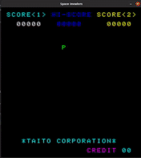

# 8080 Emulator and Space Invaders

## Table of Contents
1. [Introduction](#Introduction) 
    - [Dependencies](#Dependencies)
    - [Required Build Tools](#Required Build Tools)
    - [System Requirements](#System Requirements)
    - [Installation](#Installation instructions for the library dependencies)
2. [Project Quickstart](#Project Quickstart)
    - [Play Space Invaders Game](#Play Space Invaders Game)
    - [Running the Emulator](#Running the Emulator)
    - [Speed Benchmarking and Speed Adjustment](#Speed Benchmarking and Speed Adjustment)
    - [CPU Testing](#CPU Testing)
3. [Reference materials and resources](#Reference materials and resources)
## Introduction
The Intel-8080 is an 8-bit microprocessor that Intel began producing in 1974. It could support clock rates up to 2 MHz. It has 8 main 8-bit registers, including an accumulator and a flags register. It also contains a 16-bit stack pointer and a 16-bit program counter. Furthermore, each pair of main registers (except the accumulator/flags registers) can be read/written as three 16-bit registers. It interfaces with the outside world through 40 pins. Included in these pins are 8 bidirectional data pins, 16 output address pins, two clock pins, an interrupt pin, a reset pin, and various other pins for power supply and indicating/controlling the processor state.

Space Invaders is a 1978 arcade game by Taito. The game’s goal is to defeat five rows of eleven aliens that move horizontally back and forth across the screen as they advance toward the bottom of the screen. 

Space Invaders is a processor-based system consisting of an Intel 8080 CPU running at roughly 2 MHz, 8K ROM, 8K of RAM, a 2-byte shift register, and specialized audio and display hardware. The goal of this project is to create an Intel 8080 emulator in C/C++ that can execute a Space Invaders ROM file and play the game. This project will heavily draw from the knowledge gained from CS 271, Computer Architecture and Assembly Language, as well some others like CS 344, Operating Systems, to understand how the Intel 8080 operates and emulate its behavior using C/C++.

### Dependencies
- SDL2 development libraries
    - Core SDL2 libs
    - SDL2 image libs
    - SDL2 mixer libs
- Google Test development libraries for C++.
    
### Required Build Tools
- CMake version 3.10 or higher.
- GCC/G++ version 10.  (8 works, but has not been thoroughly tested.  Clang/LLVM has not been tested.)

### System Requirements
- Linux (Will not compile at all on Mac; Mac support is something we hope to implement, but only one of us has access to a Mac.)
- Little-endian architecture.  This is unlikely to come up, but the emulator relies heavily on type-punning; it simply will not work on a big-endian system.
- A working X server is required to play Space Invaders.  The hardware test ROMs are purely console, however, and do not require X.  X is not supported out of the box on WSL/WSL2 or in docker containers, so Space Invaders (or any other graphical program!) will not work in those environments without considerable setup.

### Installation instructions for the library dependencies
- Distros using the apt package manager (e.g., Debian, Ubuntu, Mint:)
    - `$ sudo apt-get install cmake libgtest-dev libsdl2-dev libsdl2-image-dev libsdl2-mixer-dev`
- Distros using the pacman package manager (i.e. Arch, Manjaro:)
    - `$ sudo pacman -Syyu cmake gtest sdl2 sdl2_image sdl2_mixer`

## Project Quickstart
- Clone this repository        
- Within the project directory, create a build subdirectory. (i.e. Debug or Release) 
    - e.g. `mkdir release` or `mkdir debug`
- Navigate into your subdirectory, and run either of the following:
    - `cmake -DCMAKE_BUILD_TYPE=Release ..`
    - `cmake -DCMAKE_BUILD_TYPE=Debug ..`
- The Debug build target will add realtime disassembly and CPU state output on `stderr`.  
- Run `make`.  Once a build tree is established for a build type, any changes to the actual source files will be picked up by make.
- Run `make test` to run unit tests, if desired.
### Play Space Invaders Game
- In the `release` subdirectory, run `make` and then `./8080 -r roms/invaders_cv --hw si` to play Space Invaders.
- Keyboard control:
    - `C` = Insert coin
    - `S` = 1 Player start
    - `Down` = 2 Player start
    - `A` = Player 1 left
    - `D` = Player 1 right
    - `W` = Player 1 shoot
    - `Left` = Player 2 left
    - `Right` = Player 2 right
    - `Up` = Player 2 shoot
    - `R` = Reset game
    - `Esc` = Quit game
    - `T` = Tilt
    - numbers 0-7 = dip switches
    - number 8 = Sound on/off (default is sound on)
### Running the Emulator
`make` will produce an executable called `8080`, and some shared library files which define external hardware sets.  (An 8080 not hooked into anything is of limited use!)
`8080` has the following options:
- `-r FILE`, `--rom FILE`
  - Required.  Specifies the ROM file to load into the 8080's memory.
- `--hw FILE`, `--hardware FILE` 
  - Optional.  Specifies the name of the hardware library to load.  If omitted, an empty hardware set will be loaded in which no front-end is launched, and the `IN` and `OUT` opcodes will do nothing except burn cycles.  Specifying `none` here will explicitly load the empty hardware set.
- `-h`, `--help`
  - Print usage instructions and exit.
- You can create a test ROM file like this, if you lack access to an assembler: `echo -e -n \\x26\\x01\\x2e\\x01\\x36\\xff\\x46\\x76 > rom`
  - This example ROM will run the following:
    - MVI H 0x01
    - MVI L 0x01
    - MVI M 0xff
    - MOV B, M
    - HLT
  This will leave the CPU in an (emulated) halt state, during which it will continue to check to see if a hardware reset has been requested; effectively a low-CPU usage spinlock.  With the empty hardware set, there is no way to send such a reset.
### Speed Benchmarking and Speed Adjustment
To get CPU speed benchmarking output on `stderr`, define `BENCHMARK`:
- `make C_FLAGS="-DBENCHMARK"`

(Note that it may be `CFLAGS` rather than `C_FLAGS`, depending on your version of `make`.)

By default, CPU benchmark output will be printed every 2^23 cycles. (~8 million.)  You can override this by passing in a replacement value for `BENCH_INTERVAL`.
- `make C_FLAGS="-DBENCHMARK -DBENCH_INTERVAL=1000000"`

The above command would result in benchmark output every million cycles, which would be twice per second at 2 MHz.

By default, the CPU will be built with an emulated cycle time of 500ns, which equates to 2 MHz.  You can adjust this by passing in a replacement value for `CYCLE_TIME`
- `make C_FLAGS="-DCYCLE_TIME=250"`

The above command would result in a 4Mhz emulation.

Defines can, of course, be mixed:
- `make C_FLAGS="-DCYCLE_TIME=100 -DBENCHMARK -DBENCH_INTERVAL=2000000"`

Do note that (by far) the most expensive portion of the normal CPU loop is the timing portion.  Even with a `CYCLE_TIME` of zero, the timing logic will still be traversed.  The main use of the benchmarking is to gauge the accuracy of the emulated speed, not to maximize it.  We may add a true unthrottled mode later; experimentation has shown a ~4x speed increase which may have its uses.

Note also that if `VERBOSE` is set while benchmarking, the overhead of all the printing calls could well drive effective emulation speed below 2MHz on slower systems.

To actually run the benchmark, simply run the emulator as normal.  Do note that for benchmarking to be of any use, the ROM you choose to run will have to execute for at least `BENCH_INTERVAL` cycles of the 8080.  A simple looping ROM is recommended.

### CPU Testing
At present, the emulator passes the available 8080 test ROMs we have access to.  These are included in the repo; when the project is built, ROMs are placed in a `roms` subdirectory, relative to the executable.

Three test roms are available:
- The 1980 Microcosm Associates test, usually called TST8080.
- - `roms/cpudiag`
- The 1981 Supersoft Associates Diagnostic II v. 1.2, usually called CPUTEST.
- - `roms/cputest`
- The 1994 zexlax Z80 Exerciser by Frank Cringle, with the 2009 modifications by Ian Bartholomew.
- - `roms/exerciser`

Assembly source for all three can be found at https://altairclone.com/downloads/cpu_tests/ .

All three were originally written to be run under CP/M.  For our purposes, they should be run with the `cpudiag` hardware library, which emulates two CP/M print routines by repurposing the `OUT` instruction.

Note that the binaries for all three have been modified to make them suitable for our emulator: because they expect to be loaded into a running OS, they all expect to begin at `0x100`.  The modified roms place them there directly by padding the binary, and further adjust some of the low memory to emplace the call to `OUT` and to jump from `0x0` (where emulator execution begins) to `0x100` (where the programs start).  As originally designed, they also jump back to `0x0` when they finish, to return control to CP/M.  Those jumps have been replaced with `HLT`.

To run one, just specify the rom and the hardware set, e.g. `./8080 -r roms/cputest --hw cpudiag`.

It is strongly recommended, however, that you build an unthrottled version first:

`make clean && make C_FLAGS="-DUNTHROTTLED -O2"`

Though this isn't mandatory, be aware that at 2MHz, `cputest` will take several minutes, and `exerciser` will take several hours.  If you build a debug version, and your system is slow enough that the debug disassembly drives speed below 2MHz, it will of course take even longer.

Because we end execution by halting, you will need to manually terminate the emulator when execution finishes.  There is, after all, no way to quit an 8080 except to cut the power.

Finally, note that the CP/M print calls are sent to `stdout`, while debug disassembly is sent to `stderr`.  Should you wish to view a live disassembly of the ROM while still seeing the intended output, you can pipe one or the other to a different terminal.  On Linux (the only OS the emulator currently supports,) you can use `tty` to determine the device filename for a given terminal.

So for example, if I have one terminal window open and `tty` tells me that it is `/dev/pts/2`, then in a second terminal window I can execute `./8080 -r roms/cpudiag --hw cpudiag >/dev/pts/2` to direct `stdout` to the first terminal while keeping the disassembly on the second.

## Reference materials and resources
This section contains some helpful reference materials and resources for the Intel-8080 processor and Space Invaders
* [Intel 8080 Wikipedia page](https://en.wikipedia.org/wiki/Intel_8080)
* [Intel 8080 Assembly Language Programming Manual](https://altairclone.com/downloads/manuals/8080%20Programmers%20Manual.pdf)
* [Intel 8080 Opcodes overview](http://www.piclist.com/techref/intel/8080.htm)
* [Intel 8080 Opcodes detailed](https://pastraiser.com/cpu/i8080/i8080_opcodes.html)
* [Architecture of the Intel 8080](https://www.elprocus.com/know-about-architecture-of-the-intel-8080-microprocessor/)
* [Space Invaders Wikipedia page](https://en.wikipedia.org/wiki/Space_Invaders)
* [Classic Gaming Space Invaders (play online and more)](http://www.classicgaming.cc/classics/space-invaders/)
* [Course materials for CS-450 Computer Graphics](https://web.engr.oregonstate.edu/~mjb/cs550/)
