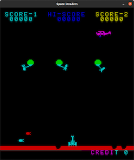
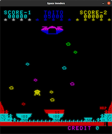

# 8080 Emulator and Space Invaders

## Table of Contents
1. [Introduction](#Introduction) 
    - [Features](#Features)
    - [Dependencies](#Dependencies)
    - [Required Build Tools](#Required-Build-Tools)
    - [System Requirements](#System-Requirements)
    - [Installation](#Installation-instructions-for-the-library-dependencies)
2. [Project Quickstart](#Project-Quickstart)
    - [Play Space Invaders Game](#Play-Space-Invaders-Game)
    - [Altair 8k BASIC](#Altair-8k-Basic)
    - [Running the Emulator](#Running-the-Emulator-with-other-ROMs-or-Hardware-Sets)
    - [Speed Benchmarking and Speed Adjustment](#Speed-Benchmarking-and-Speed-Adjustment)
    - [CPU Testing](#CPU-Testing)
3. [ROM Files and Read-Only Masking](roms/README.md)
4. [Adding New Hardware Libraries](hardware/README.md)
4. [Reference materials and resources](#Reference-materials-and-resources)
## Introduction
The Intel-8080 is an 8-bit microprocessor that Intel began producing in 1974. It could support clock rates up to 2 MHz. It has 8 main 8-bit registers, including an accumulator and a flags register. It also contains a 16-bit stack pointer and a 16-bit program counter. Furthermore, each pair of main registers (except the accumulator/flags registers) can be read/written as three 16-bit registers. It interfaces with the outside world through 40 pins. Included in these pins are 8 bidirectional data pins, 16 output address pins, two clock pins, an interrupt pin, a reset pin, and various other pins for power supply and indicating/controlling the processor state.

Space Invaders is a 1978 arcade game by Taito. The game’s goal is to defeat five rows of eleven aliens that move horizontally back and forth across the screen as they advance toward the bottom of the screen. 

Space Invaders is a processor-based system consisting of an Intel 8080 CPU running at roughly 2 MHz, 8K ROM, 8K of RAM, a 2-byte shift register, and specialized audio and display hardware. The goal of this project is to create an Intel 8080 emulator in C/C++ that can execute a Space Invaders ROM file and play the game. This project will heavily draw from the knowledge gained from CS 271, Computer Architecture and Assembly Language, as well some others like CS 344, Operating Systems, to understand how the Intel 8080 operates and emulate its behavior using C/C++.

### Features
- [x] Playable games: Space Invaders, Balloon Bomber, Lunar Rescue, and Ozma
- [x] Keyboard controls
- [x] Colored screen
- [x] Resizable screen
- [x] Sound
- [x] Altair 8k Basic

### Dependencies
- SDL2 development libraries
    - Core SDL2 libs
    - SDL2 image libs
    - SDL2 mixer libs
- Google Test development libraries for C++.
- NCurses
    
### Required Build Tools
- CMake version 3.10 or higher.
- GCC/G++ version 10.  (8 works, but has not been thoroughly tested.  Clang/LLVM has not been tested.)

### System Requirements
- Linux (Will not compile at all on Mac; Mac support is something we hope to implement, but only one of us has access to a Mac.)
- Little-endian architecture.  This is unlikely to come up, but the emulator relies heavily on type-punning; it simply will not work on a big-endian system.
- A working X server is required to play Space Invaders.  The hardware test ROMs are purely console, however, and do not require X.  Altair BASIC can also be run without X.  X is not supported out of the box on WSL/WSL2 or in docker containers, so Space Invaders (or any other graphical program!) will not work in those environments without considerable setup.

### Installation instructions for the library dependencies
- Distros using the apt package manager (e.g., Debian, Ubuntu, Mint:)
    - `$ sudo apt-get install cmake libgtest-dev libsdl2-dev libsdl2-image-dev libsdl2-mixer-dev libncurses-dev`
- Distros using the pacman package manager (i.e. Arch, Manjaro:)
    - `$ sudo pacman -Syyu cmake gtest sdl2 sdl2_image sdl2_mixer ncurses`

## Project Quickstart
- Clone this repository        
- Within the project directory, create a build subdirectory. (i.e. Debug or Release) 
    - e.g. `mkdir release` or `mkdir debug`
- Navigate into your subdirectory, and run either of the following:
    - `cmake -DCMAKE_BUILD_TYPE=Release ..`
    - `cmake -DCMAKE_BUILD_TYPE=Debug ..`
- The Debug build target will add realtime disassembly and CPU state output on `stderr`.  
- Run `make`.  Once a build tree is established for a build type, any changes to the actual source files will be picked up by make.
- Run `make test` to run unit tests, if desired.
### Play Space Invaders Game
 
- Keyboard control:

| Key | Description |
| --- | --- |
| C | Insert Coin |
| S | 1 Player start |
| Down | 2 Player start |
| A | Player 1 left |
| D | Player 1 right |
| W | Player 1 shoot |
| Left | Player 2 left |
| Right | Player 2 right |
| Up | Player 2 shoot |
| R | Reset game |
| Esc | Quit game |
| T | Tilt |
| 0-7 | dip switches |
| 8 | Sound on/off |

- In the `release` subdirectory, run `make` and then `./8080 -r roms/invaders_cv --hw si` to play Space Invaders.  
    - Note that while you can play the game on a Debug build, it will be very slow on most systems due to the overhead of the continuous disassembly printing.
- You can optionally play other games using the same `si` hardware lib, such as Balloon Bomber, Lunar Rescue, and Ozma. They use the same keyboard controls as SI.
    - `./8080 -r roms/balloon --hw si`
    
    
    - `./8080 -r roms/lunar_rescue --hw si`
    
    
    - `./8080 -r roms/ozma --hw si`
    
    

### Altair 8K BASIC
#### Running BASIC
 The emulator includes the [Altair Clone ROM of Altair 8k BASIC 4.0](https://altairclone.com/downloads/roms/8K%20BASIC/).  Because Altair BASIC handled text I/O via the Altair 8800's serial card, we have added an `ncurses`-based hardware library for use with the ROM.
 
 Build either a release or debug version of the emulator with `make` in the appropriate directory.  To run BASIC:

 - `./8080 -r roms/basic --hw basic`

 Be aware that if you are using a Debug build, you will need to redirect `stderr` somewhere else, or BASIC's output will be mixed with the disassembly in a very unpleasant manner.

 Because `Ctrl-C` (`^C`) is a crucial keyboard shortcut within BASIC, input is taken raw, meaning that the terminal will not intercept special combinations.  As such, the following combinations will work in the following ways:

 - `^C` will be interpreted by BASIC itself, which uses it to interrupt a running BASIC program.
 - `^D`, `^\`, and `^[` will all exit the emulator cleanly.  Note in particular that `\^` will not generate `SIGQUIT`, it will simply exit.

 The escape key (which generates `^[`) will also exit.

 - NOTE: The exit shortcuts will not work if the emulator is compiled in `UNTHROTTLED` mode.  (See [here](#Speed-Benchmarking-And-Speed-Adjustment) for an explanation of throttling.)  If you run the emulator unthrottled, you will have to kill it from another terminal.

There is no mechanism for loading or saving a program within the hardware library: however, pasting may work, depending on your terminal.  Otherwise, you are limited to what you can type yourself.

#### Using BASIC

On startup, BASIC will ask you about memory size: you can safely hit enter here, and it will simply scan the program's memory space.  A ROM mask is provided which makes the very last 1KB page of memory read-only, so BASIC's probe will find 63k of system RAM.  (It will, however, report less as available due to the space it itself takes up.)

BASIC will then ask about terminal width: hitting enter here will default to 72 columns.

The third question BASIC asks on startup is whether you wish the math libraries loaded: BASIC expects `Y` or `N` here: lower-case will not work.

After answering these three questions, you should receive an `OK` prompt, after which you may do as you like.  A BASIC reference manual is available [here](https://altairclone.com/downloads/manuals/BASIC%20Manual%2075.pdf).

#### Mischief

Note that the memory occupied by BASIC itself is not protected: you are free to corrupt it with `POKE` if you so desire.  The effects are unlikely to be terribly interesting, however: because there's no video controller in an Altair 8800, there's no video to corrupt.

Should your inner child be inclined towards the `BEEP` command, it does not, alas, exist.  However, `PRINT CHR$(7)` will attempt to beep, if your terminal supports it.  The results are particularly obnoxious in WSL, though be sure to use other commands to space out the calls to `PRINT CHR$(7)`, or you will achieve only a slightly disappointing buzzing.

### Running the Emulator with other ROMs or Hardware Sets
`make` will produce an executable called `8080`, and some shared library files which define external hardware sets.  (An 8080 not hooked into anything is of limited use!)
`8080` has the following options:
- `-r FILE`, `--rom FILE`
  - Required.  Specifies the ROM file to load into the 8080's memory.
- `--hw LIB`, `--hardware LIB` 
  - Optional.  Specifies the name of the hardware library to load.  If omitted, an empty hardware set will be loaded in which no front-end is launched, and the `IN` and `OUT` opcodes will do nothing except burn cycles.  Specifying `none` here will explicitly load the empty hardware set.
- `-h`, `--help`
  - Print usage instructions and exit.
- You can create a test ROM file like this, if you lack access to an assembler: `echo -e -n \\x26\\x01\\x2e\\x01\\x36\\xff\\x46\\x76 > rom`
  - This example ROM will run the following:
    - MVI H 0x01
    - MVI L 0x01
    - MVI M 0xff
    - MOV B, M
    - HLT
  This will leave the CPU in an (emulated) halt state, during which it will continue to check to see if a hardware reset has been requested; effectively a low-CPU usage spinlock.  With the empty hardware set, there is no way to send such a reset.
### Speed Benchmarking and Speed Adjustment
CPU speed benchmarking and CPU speed adjustment are controlled through CMake cache variables.  These instructions will assume you are building in a subdirectory of the project root; you will have to adjust the path to CMakeLists.txt as appopriate if you are building somewhere else.

To turn benchmarking on, turn on the `BENCHMARKING` option:

- `cmake -DBENCHMARKING=ON ..`

This setting is persistent, and all builds will have benchmarking until you turn it back off:

- `cmake -DBENCHMARKING=OFF ..`

To adjust the benchmarking interval, define `INTERVAL`:

- `cmake -DINTERVAL=1000000 ..`

The above would set the interval one million cycles; at the default CPU speed, this is every half second.  To unset this setting, run:

- `cmake -UINTERVAL ..`

To adjust the speed of CPU execution, you can override the time-value of each CPU cycle.  By default, this is 500 nanoseconds, which is appopriate to 2MHz execution.  You can change it by adjusting the CMake variable `CYCLE_TIME`:

- `cmake -DCYCLE_TIME=250 ..`

The above will get you 4MHz emulation.

To return to the default, unset the variable:

- `cmake -UCYCLE_TIME ..`

Note that adjusting the cycle time-value has its limits: the timekeeping itself is very expensive.  To get maximum throughput (e.g. when running a CPU test ROM) you may wish to completely unthrottle the emulated CPU.  This can be turned on via:

- `cmake -DUNTHROTTLE=ON`

It can be turned off again via:

- `cmake -DUNTHROTTLE=OFF`

Note that because the unthrottled mode completely bypasses the timekeeping, no benchmarking is available.

### CPU Testing
At present, the emulator passes the available 8080 test ROMs we have access to.  These are included in the repo; when the project is built, ROMs are placed in a `roms` subdirectory, relative to the executable.

Three test roms are available:
- The 1980 Microcosm Associates test, usually called TST8080.
    - `roms/cpudiag`
- The 1981 Supersoft Associates Diagnostic II v. 1.2, usually called CPUTEST.
    - `roms/cputest`
- The 1994 zexlax Z80 Exerciser by Frank Cringle, with the 2009 modifications by Ian Bartholomew.
    - `roms/exerciser`

Assembly source for all three can be found at https://altairclone.com/downloads/cpu_tests/ .

All three were originally written to be run under CP/M.  For our purposes, they should be run with the `cpudiag` hardware library, which emulates two CP/M print routines by repurposing the `OUT` instruction.

Note that the binaries for all three have been modified to make them suitable for our emulator: because they expect to be loaded into a running OS, they all expect to begin at `0x100`.  The modified roms place them there directly by padding the binary, and further adjust some of the low memory to emplace the call to `OUT` and to jump from `0x0` (where emulator execution begins) to `0x100` (where the programs start).  As originally designed, they also jump back to `0x0` when they finish, to return control to CP/M.  Those jumps have been replaced with `HLT`.

To run one, just specify the rom and the hardware set, e.g. `./8080 -r roms/cputest --hw cpudiag`.

It is strongly recommended, however, that you build an unthrottled version first:

`cmake -DUNTHROTTLE=ON .. && make`

Though this isn't mandatory, be aware that at 2MHz, `cputest` will take several minutes, and `exerciser` will take several hours.  If you build a debug version, and your system is slow enough that the debug disassembly drives speed below 2MHz, it will of course take even longer.

Because we end execution by halting, you will need to manually terminate the emulator when execution finishes.  There is, after all, no way to quit an 8080 except to cut the power.

Finally, note that the CP/M print calls are sent to `stdout`, while debug disassembly is sent to `stderr`.  Should you wish to view a live disassembly of the ROM while still seeing the intended output, you can pipe one or the other to a different terminal.  On Linux (the only OS the emulator currently supports,) you can use `tty` to determine the device filename for a given terminal.

So for example, if I have one terminal window open and `tty` tells me that it is `/dev/pts/2`, then in a second terminal window I can execute `./8080 -r roms/cpudiag --hw cpudiag >/dev/pts/2` to direct `stdout` to the first terminal while keeping the disassembly on the second.

## Reference materials and resources
This section contains some helpful reference materials and resources for the Intel-8080 processor and Space Invaders
* [Intel 8080 Wikipedia page](https://en.wikipedia.org/wiki/Intel_8080)
* [Intel 8080 Assembly Language Programming Manual](https://altairclone.com/downloads/manuals/8080%20Programmers%20Manual.pdf)
* [Intel 8080 Opcodes overview](http://www.piclist.com/techref/intel/8080.htm)
* [Intel 8080 Opcodes detailed](https://pastraiser.com/cpu/i8080/i8080_opcodes.html)
* [Architecture of the Intel 8080](https://www.elprocus.com/know-about-architecture-of-the-intel-8080-microprocessor/)
* [Space Invaders Wikipedia page](https://en.wikipedia.org/wiki/Space_Invaders)
* [Classic Gaming Space Invaders (play online and more)](http://www.classicgaming.cc/classics/space-invaders/)
* [Course materials for CS-450 Computer Graphics](https://web.engr.oregonstate.edu/~mjb/cs550/)
